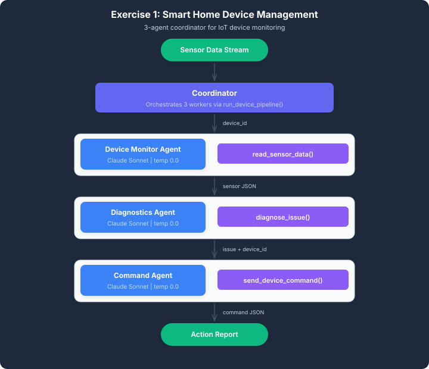

# AWS Smart Home Multi-Agent System

### Intelligent Device Monitoring, Diagnostics, and Automated Corrective Actions

A multi-agent smart home device management system built with **Amazon Bedrock, Strands Agents, and Python** to monitor device telemetry, diagnose hardware and connectivity anomalies, and dispatch simulated corrective commands.

The project demonstrates how specialized AI agents can collaborate through a centralized coordinator to transform raw sensor readings into structured diagnostic results and automated device-management actions.

---

## 1. Project Overview

Smart home environments contain interconnected devices such as thermostats, smart locks, security cameras, and environmental sensors.

These devices continuously generate telemetry data that can indicate operational problems, including excessive temperature, poor connectivity, and low battery levels.

Without effective monitoring and diagnostic capabilities, these problems may remain undetected until they affect device functionality.

This project implements a multi-agent backend workflow that:

- Retrieves telemetry readings from registered smart home devices.
- Evaluates sensor readings against predefined diagnostic rules.
- Identifies device anomalies and their associated issue types.
- Determines and dispatches the corresponding simulated corrective commands.
- Produces structured diagnostic and command-execution reports.

The system uses three specialized AI agents coordinated through a central Python function.

### Project Scope

This implementation demonstrates an agent-based device-management workflow using predefined sample telemetry and simulated corrective commands.

It does not connect to physical smart home devices or execute actual firmware updates, hardware restarts, or homeowner notifications.

---

## 2. Business Problem

A smart home automation company needs a backend system capable of detecting device problems and coordinating corrective actions.

The company manages multiple categories of connected devices, each generating different operational metrics.

For example:

- A thermostat may experience excessive temperature.
- A smart lock may report poor network connectivity.
- A doorbell camera may experience critically low battery levels.

These issues require different diagnostic rules and corrective actions.

A single system must therefore coordinate telemetry retrieval, issue detection, and command dispatch while preserving information about the affected device.

### Proposed Solution

Implement a multi-agent coordinator architecture consisting of:

1. A Device Monitor Agent responsible for telemetry retrieval.
2. A Diagnostics Agent responsible for anomaly identification.
3. A Command Agent responsible for corrective-command dispatch.

A centralized Python coordinator orchestrates the agents and passes structured JSON responses between the different stages.

---

## 3. System Architecture

The system follows a sequential multi-agent coordinator pattern.

Each agent has a specialized responsibility, its own system prompt, and access to a dedicated tool.

### Architecture Diagram



### Multi-Agent Workflow

```text
             SMART HOME DEVICE
                     |
                     v
              Device ID Input
                     |
                     v
        +--------------------------+
        |    DEVICE MONITOR AGENT  |
        |                          |
        | Tool: read_sensor_data   |
        +--------------------------+
                     |
                     v
              Sensor Data JSON
                     |
                     v
        +--------------------------+
        |    DIAGNOSTICS AGENT     |
        |                          |
        | Tool: diagnose_issue     |
        +--------------------------+
                     |
                     v
            Identified Issues
                     |
                     v
        +--------------------------+
        |      COMMAND AGENT       |
        |                          |
        | Tool:                   |
        | send_device_command      |
        +--------------------------+
                     |
                     v
          Corrective Command JSON
                     |
                     v
        +--------------------------+
        |    PYTHON COORDINATOR    |
        |                          |
        | Collects sensor data,    |
        | diagnoses, and command   |
        | responses                |
        +--------------------------+
                     |
                     v
           Final Device Summary
```

The coordinator invokes the three agents sequentially and maintains the relationship between the original device ID, identified issues, and dispatched corrective commands.

---

## 4. Technologies and Tools

| Technology | Purpose |
|---|---|
| Python | Application development and workflow orchestration |
| Amazon Bedrock | Managed access to the foundation model powering the agents |
| Strands Agents SDK | Agent configuration, tool integration, and execution |
| Anthropic Claude Sonnet 4.5 | Foundation model used during successful project testing |
| Boto3 | AWS SDK and authentication support |
| python-dotenv | Environment variable management |
| JSON | Structured communication between agents |
| Git and GitHub | Version control and source-code management |

### AWS Configuration

The successful implementation was tested using:

```text
AWS Region: us-east-1

Model ID:
us.anthropic.claude-sonnet-4-5-20250929-v1:0
```

The configured model uses a US cross-region inference profile.

Running the project requires valid AWS credentials and permission to invoke the configured Amazon Bedrock model.

Model availability and access permissions may vary between AWS accounts.

---

## 5. Multi-Agent Implementation

### Agent 1: Device Monitor

The Device Monitor Agent retrieves the latest available sensor readings for a specified device.

It uses the `read_sensor_data` tool, which accesses the predefined device registry and sample telemetry dataset.

Its responsibilities include:

- Receiving the requested device ID.
- Invoking the sensor-reading tool.
- Retrieving device metadata and telemetry.
- Returning structured JSON containing the device ID, device information, timestamp, and sensor readings.
- Reporting missing devices or unavailable sensor data.

The agent is instructed not to diagnose issues or dispatch corrective commands.

### Agent 2: Diagnostics Agent

The Diagnostics Agent analyzes the sensor data returned by the Device Monitor.

It uses the `diagnose_issue` tool to apply predefined diagnostic rules.

The agent returns a structured response containing:

- Device ID.
- Number of identified issues.
- List of detected anomalies.
- Diagnostic status.

Its responsibilities are restricted to diagnosis.

The diagnostic results are passed to the coordinator, which extracts the identified issues for corrective-action processing.

### Agent 3: Command Agent

The Command Agent receives a device ID and a diagnosed issue type.

It uses the `send_device_command` tool to select and dispatch the predefined corrective action associated with that issue.

The tool returns a structured confirmation containing:

- Command status.
- Device ID and device name.
- Diagnosed issue.
- Corrective action.
- Action message.
- Timestamp.

The coordinator validates the response and collects it for the final device summary.

The provided tool simulates command dispatch rather than communicating with physical smart home hardware.

---

## 6. Agent Coordination and Data Flow

The `run_device_pipeline(device_id)` function acts as the central coordinator.

It executes the following workflow:

**Step 1: Telemetry Retrieval**

The coordinator invokes the Device Monitor Agent with the requested device ID.

The monitor retrieves the corresponding sensor readings and returns structured JSON.

**Step 2: Diagnostic Analysis**

The coordinator passes the retrieved sensor data to the Diagnostics Agent.

The Diagnostics Agent evaluates the telemetry and returns a list of identified issues.

**Step 3: Corrective Command Dispatch**

For each identified issue, the coordinator invokes the Command Agent with the device ID and issue type.

The Command Agent uses the corresponding tool to dispatch a simulated corrective command.

**Step 4: Response Collection**

The coordinator collects the sensor data, diagnostic results, and command responses into a consolidated Python dictionary.

This information is used to generate the final device summary.

### Response Processing and Error Handling

The implementation includes:

- Agent invocation with retry handling.
- JSON response parsing and validation.
- Removal of Markdown code fences from agent responses.
- Validation of device identifiers and issue types.
- Checks for missing or malformed sensor readings.
- Validation of corrective-command confirmations.

The shared response-cleaning helper removes formatting that may otherwise prevent the coordinator from parsing agent-generated JSON.

The retry helper uses exponential backoff when an agent invocation raises an exception.

---

## 7. Device Telemetry and Diagnostic Rules

The project includes three sample smart home devices.

| Device ID | Device | Primary Anomaly |
|---|---|---|
| DEV-001 | Living Room Thermostat | Excessive temperature |
| DEV-002 | Front Door Smart Lock | Poor connectivity |
| DEV-003 | Doorbell Camera | Low battery |

The predefined diagnostic rules are:

| Issue Type | Sensor Field | Condition |
|---|---|---|
| overheating | temperature | Greater than 85 |
| firmware_issue | connectivity | Less than 20 |
| low_battery | battery | Less than 10 |

The issue names and thresholds are predefined in the application's diagnostic rules.

The firmware issue classification is a rule-based label associated with low connectivity; the sample telemetry does not independently establish the underlying hardware or firmware root cause.

---

## 8. Corrective Action Mapping

Each diagnosed issue is associated with a predefined corrective command.

| Identified Issue | Corrective Action |
|---|---|
| overheating | restart_device |
| firmware_issue | push_firmware_update |
| low_battery | send_recharge_notification |

The Command Agent uses the `send_device_command` tool to dispatch the action associated with the identified issue.

The tool returns a confirmation containing the action and its associated message.

All corrective actions in this exercise are simulated.

---

## 9. Project Structure

```text
aws-smart-home-multi-agent-system/
|
|-- smart_home_device_mgmt.py
|-- architecture.svg
|-- README.md
|-- requirements.txt
|-- .env.example
|-- .gitignore
```

### File Descriptions

| File | Description |
|---|---|
| smart_home_device_mgmt.py | Main application containing the agent builders, tools, coordinator, and test scenarios |
| architecture.svg | Visual representation of the multi-agent architecture |
| README.md | Project documentation and setup instructions |
| requirements.txt | Python dependencies |
| .env.example | Environment configuration template |
| .gitignore | Excludes credentials, environment files, and generated artifacts from version control |

The actual `.env` file and AWS credentials are intentionally excluded from the repository.

---

## 10. Getting Started

### Prerequisites

Before running the project, ensure that you have:

- Python 3.11 or newer.
- An AWS account with valid credentials.
- Access to Amazon Bedrock in the configured AWS Region.
- Permission to invoke the selected foundation model.
- Git installed if you intend to clone the repository.

The project was developed and tested in a Udacity-provided Linux workspace.

### Step 1: Clone the Repository

```bash
git clone https://github.com/ayomikunadaramola/aws-smart-home-multi-agent-system.git

cd aws-smart-home-multi-agent-system
```

### Step 2: Create a Virtual Environment

On Linux or macOS:

```bash
python -m venv .venv

source .venv/bin/activate
```

On Windows:

```powershell
python -m venv .venv

.\.venv\Scripts\Activate.ps1
```

### Step 3: Install Dependencies

```bash
python -m pip install -r requirements.txt
```

### Step 4: Configure Environment Variables

Copy the environment template.

On Linux or macOS:

```bash
cp .env.example .env
```

On Windows PowerShell:

```powershell
Copy-Item .env.example .env
```

The environment file should contain:

```dotenv
AWS_REGION=us-east-1
MODEL_ID=us.anthropic.claude-sonnet-4-5-20250929-v1:0
```

Use a model and inference profile supported by your AWS account.

### Step 5: Configure AWS Credentials

Configure AWS credentials using an appropriate AWS authentication method, such as an AWS profile, temporary session credentials, or an IAM role.

The application uses Boto3 to obtain AWS credentials through its supported credential-provider chain.

Do not hardcode AWS access keys or session tokens into the Python source code.

Do not commit your `.env` file or AWS credentials to GitHub.

### Step 6: Run the Application

```bash
python smart_home_device_mgmt.py
```

The application processes the three predefined test scenarios and displays the monitoring, diagnostic, and corrective-command results in the terminal.

---

## 11. Testing and Results

The completed application was executed against all three predefined device scenarios.

All three scenarios completed successfully during the Udacity lab execution.

### Scenario 1: Thermostat Overheating

**Device:** DEV-001 — Living Room Thermostat

**Sensor reading:** Temperature of 92.5

**Expected issue:** overheating

**Observed issue:** overheating

**Corrective action:** restart_device

**Command status:** command_sent

Result: The Device Monitor retrieved the thermostat readings, the Diagnostics Agent identified overheating, and the Command Agent returned a successful simulated restart-command confirmation.

### Scenario 2: Smart Lock Connectivity

**Device:** DEV-002 — Front Door Smart Lock

**Sensor reading:** Connectivity of 12

**Expected issue:** firmware_issue

**Observed issue:** firmware_issue

**Corrective action:** push_firmware_update

**Command status:** command_sent

Result: The Diagnostics Agent identified the predefined connectivity-related issue, and the Command Agent returned a successful simulated firmware-update confirmation.

### Scenario 3: Doorbell Camera Low Battery

**Device:** DEV-003 — Doorbell Camera

**Sensor reading:** Battery level of 7

**Expected issue:** low_battery

**Observed issue:** low_battery

**Corrective action:** send_recharge_notification

**Command status:** command_sent

Result: The Diagnostics Agent identified the low-battery condition, and the Command Agent returned a successful simulated recharge-notification confirmation.

### Test Summary

| Device | Expected Issue | Observed Issue | Corrective Action | Result |
|---|---|---|---|---|
| DEV-001 | overheating | overheating | restart_device | PASS |
| DEV-002 | firmware_issue | firmware_issue | push_firmware_update | PASS |
| DEV-003 | low_battery | low_battery | send_recharge_notification | PASS |

**Overall result: 3/3 predefined test scenarios completed successfully.**

These results demonstrate successful coordination between the three specialized agents using the supplied sample telemetry and simulated corrective-command tools.

---

## 12. Technical Challenges and Solutions

### Challenge 1: Foundation Model Access

The initial model configured in the exercise was unavailable for invocation because it had been classified as a legacy model.

**Solution:** Updated the environment configuration to use an accessible Claude Sonnet 4.5 inference profile and verified model invocation through Amazon Bedrock.

### Challenge 2: AWS Authentication

The Udacity workspace initially did not expose usable AWS credentials to the Python environment.

**Solution:** Configured the temporary lab credentials and verified authentication using Boto3 and AWS Security Token Service.

### Challenge 3: Agent Response Formatting

The Device Monitor returned JSON enclosed in Markdown code fences, causing the coordinator's JSON parser to fail.

**Solution:** Extended the shared response-cleaning helper to remove Markdown code fences before JSON parsing.

After the fix, the complete multi-agent pipeline successfully processed all three test scenarios.

---

## 13. Current Limitations

The implementation demonstrates the multi-agent coordinator pattern but has several limitations:

- Device telemetry is retrieved from predefined sample data rather than live IoT sensors.
- Corrective commands are simulated and do not directly control physical devices.
- The diagnostic rules use predefined thresholds rather than predictive models.
- The application processes three predefined scenarios rather than continuously monitoring a device fleet.
- The current implementation has not been validated for production-scale workloads.
- Additional testing is required for malformed telemetry, unavailable devices, command failures, and multiple simultaneous issues.

These limitations define the scope of the current exercise and provide opportunities for future development.

---

## 14. Future Improvements

The following enhancements could extend the project toward a production-oriented IoT device-management platform.

### Live IoT Telemetry Integration

Integrate AWS IoT Core to ingest telemetry from registered smart home devices.

Replace the predefined sensor dataset with live device messages.

### Real Device Command Dispatch

Integrate an authenticated device-command interface to deliver corrective commands to actual devices.

Introduce command acknowledgments and post-action verification.

### Event-Driven Processing

Use AWS Lambda and event-driven messaging to initiate the monitoring workflow when telemetry events indicate a potential anomaly.

### Persistent Device History

Store telemetry, diagnostic results, and corrective-action records in Amazon DynamoDB or another suitable data store.

This would support historical analysis, reporting, and device-health tracking.

### Advanced Anomaly Detection

Extend threshold-based diagnostics with statistical analysis or machine learning to identify abnormal sensor behavior.

### Observability and Monitoring

Introduce structured logging, metrics, execution tracing, and failure alerts.

### Automated Testing

Add unit and integration tests for agent coordination, JSON validation, missing telemetry, multiple detected issues, and command failures.

### Safety and Reliability Controls

Introduce authorization, command validation, duplicate-command prevention, rate limiting, and human approval for potentially disruptive corrective actions.

---

## 15. Learning Outcomes

This project provided practical experience in:

- Building specialized AI agents using the Strands Agents SDK.
- Configuring foundation models through Amazon Bedrock.
- Integrating Python tools into agent workflows.
- Implementing a sequential multi-agent coordinator pattern.
- Passing structured JSON responses between agents.
- Handling agent-response formatting and execution errors.
- Authenticating AWS SDK requests.
- Testing and debugging an end-to-end agentic workflow.

The implementation illustrates how a coordinated multi-agent architecture can separate monitoring, diagnosis, and action execution into independently defined responsibilities.

---

## 16. Project Background

This project was developed as part of the Udacity AWS Future Agent Engineer learning program.

The implementation uses the Smart Home Device Management exercise's supplied device registry, sample telemetry, diagnostic rules, and tool interfaces, with the multi-agent configuration and coordinator workflow completed as part of the exercise.

---

## Author

**Ayomikun Adaramola**

Senior Data Engineer | Cloud Data Engineering | Agentic AI

[GitHub Profile](https://github.com/ayomikunadaramola)
